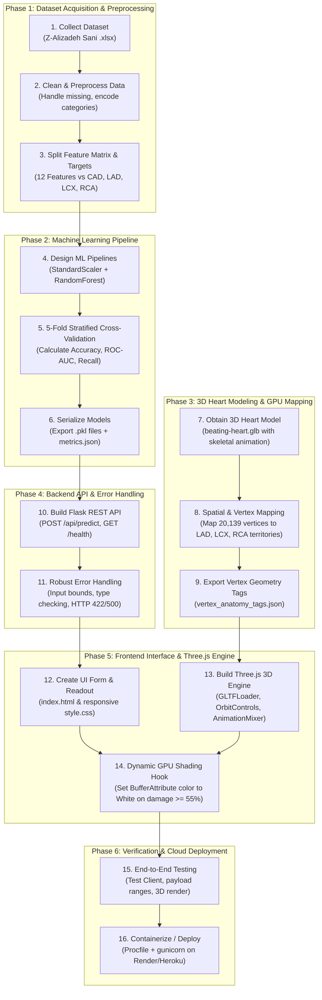

# Cardiac risk map

Interactive 3D heart that colours each coronary artery (LAD, LCX, RCA) by its predicted chance of
stenosis, plus an overall coronary artery disease (CAD) risk. Built with Flask, scikit-learn and Three.js.

> Educational demo trained on 303 patients. Not a medical device and not for diagnosis.

## How it works

1. The form collects 12 clinical values (patient, symptoms/ECG, echocardiogram).
2. Four Random Forest models run on the same input: one for overall CAD and one per artery.
3. The API returns four probabilities. The browser maps them onto the 3D heart: green/cyan for normal, and stark white for damaged tissue (>=55%).
4. Arteries whose model is weak are drawn semi-transparent and labelled **low confidence**.

## Project Development Lifecycle (Scratch to Deployment how we developed)



## Project structure

```
cardiac-3d-risk/
├── app.py                  Flask app and API routing
├── Procfile                gunicorn entry point (Render / Heroku)
├── requirements.txt
├── docs/
│   ├── PROJECT_BUILD_GUIDE.md Step-by-step roadmap to build this project from scratch
│   ├── architecture_flow.md  System Architecture & Runtime Flowchart
│   
├── data/raw/               Z-Alizadeh Sani clinical dataset (.xlsx)
├── models/                 Trained ML models (.pkl) + model_metrics.json
├── src/
│   ├── config.py           Paths, targets, and input field definitions
│   ├── data.py             Dataset preprocessing and cleaning
│   ├── train.py            Model training + 5-fold cross-validation
│   └── predict.py          Input validation and inference engine
├── templates/
│   ├── index.html          Main application view
│   └── flowchart.html      Interactive system architecture diagram
└── static/
    ├── css/style.css       Application styling
    ├── data/               3D anatomical vertex mapping data
    ├── models/             Realistic beating heart 3D model (.glb)
    └── js/
        ├── heart3d.js      Three.js scene: GPU vertex shading & controls
        └── app.js          Form processing and client-side logic
```

## Run locally

```bash
python -m venv .venv
source .venv/bin/activate        # Windows: .venv\Scripts\activate
pip install -r requirements.txt
python -m src.train              # optional: models are already included
python app.py                    # open http://localhost:5000
```

Three.js and the fonts load from a CDN, so the page needs an internet connection.

## API

| Method | Path | Purpose |
|---|---|---|
| GET | `/` | Page |
| POST | `/api/predict` | JSON in (field ids from `src/config.py`), risks out |
| GET | `/api/metrics` | Cross-validated model metrics |
| GET | `/health` | Health check |

## Deploy on Render

- Build command: `pip install -r requirements.txt && python -m src.train`
- Start command: `gunicorn app:app`

## Model results (5-fold cross-validation)

| Target | Accuracy | Guessing baseline | ROC-AUC | Confidence |
|---|---|---|---|---|
| Overall CAD | 86.5% | 71.3% | 0.93 | reliable |
| LAD | 77.2% | 58.4% | 0.84 | reliable |
| LCX | 63.7% | 60.7% | 0.73 | low |
| RCA | 65.7% | 62.4% | 0.71 | low |

Overall CAD and LAD beat the guessing baseline clearly. LCX and RCA are only slightly better than
guessing, which is why the interface flags them as low confidence. Numbers come from a small dataset,
so expect them to move by a few points between runs and to be lower on new hospitals' data.

## Limitations

- 303 patients from a single centre; no external validation.
- Probabilities come from class-weighted Random Forests and are not calibrated.
- The 3D heart is a stylised model. Artery positions are illustrative, not patient-specific anatomy.

## Dataset

Alizadehsani, R., Roshanzamir, M., Sani, Z. *Extension of Z-Alizadeh Sani dataset*.
UCI Machine Learning Repository. Licensed CC BY 4.0.
https://archive.ics.uci.edu/dataset/411/extention+of+z+alizadeh+sani+dataset

## Credits & 3D Model License

- **3D Heart Model:** [“Beating Heart”](https://skfb.ly/owVVo) by Dreamwasabducted, licensed under [Creative Commons Attribution (CC BY 4.0)](http://creativecommons.org/licenses/by/4.0/).
- **Anatomical Reference Text:** Medical descriptions based on [de.wikipedia.org](http://de.wikipedia.org/).
