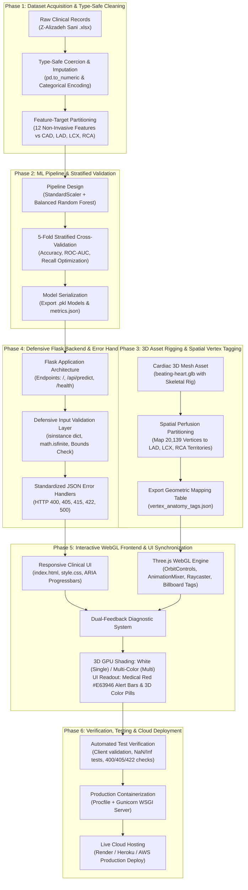

# Cardiac Risk 3D - AI-Powered Coronary Artery Disease & Territory Mapping

An interactive clinical AI and WebGL platform that predicts stenosis risk across the primary coronary arteries (**LAD**, **LCX**, **RCA**) and overall Coronary Artery Disease (**CAD**), projecting real-time risk scores onto an anatomically partitioned 3D beating heart model with dynamic GPU vertex shading and an accessible clinical readout.

> **Clinical Disclaimer:** This application is an educational and research prototype trained on 303 patient records from the Z-Alizadeh Sani clinical dataset. It is not an FDA/CE-cleared medical device and should not be used as the sole basis for clinical diagnosis.

---

## Key Features & Highlights

- **Multi-Target Ensemble Machine Learning:**
  - 4 specialized `RandomForestClassifier` pipelines predicting:
    1. Overall Coronary Artery Disease (`CAD`)
    2. Left Anterior Descending Artery (`LAD`) Stenosis
    3. Left Circumflex Artery (`LCX`) Stenosis
    4. Right Coronary Artery (`RCA`) Stenosis
  - 5-Fold Stratified Cross-Validation with balanced class weights.
- **Real-Time 3D WebGL Heart Rendering (Three.js):**
  - Continuous 60 FPS skeletal cardiac cycle deformation (`beating-heart.glb`).
  - Studio lighting, responsive camera orbit controls, and camera-facing anatomical billboard tags.
  - Interactive anatomical raycasting to inspect local myocardial territories and vessel supply zones.
- **Dual Visual Diagnostic Feedback System:**
  - **3D Heart GPU Shading (Direct `BufferAttribute` Overdrive):**
    - **Single Damaged Artery ($\ge 55\%$):** Stark Glowing White (`#FFFFFF`, HDR multiplier `6.5`).
    - **Multiple Damaged Arteries ($\ge 55\%$):** High-contrast multi-color palette:
      - **LAD Territory:** Stark White (`#FFFFFF`)
      - **LCX Territory:** Electric Cyan (`#00E5FF`)
      - **RCA Territory:** Vivid Amber/Gold (`#FFB800`)
    - **Normal / Baseline Territory ($< 55\%$):** Clinical soft teal/green gradient.
  - **Clinical Readout Panel:**
    - High-contrast alert progress bars with bold **Medical Red (`#E63946`)** fill for stenosed arteries.
    - Matching 3D color pill tags (`3D: White`, `3D: Cyan`, `3D: Gold`) for instantaneous cross-referencing.
    - Full WCAG 2.1 AA compliant contrast ratios and ARIA accessibility (`role="progressbar"`, `aria-valuenow`, `aria-live="polite"`).
- **Defensive Production Gateway (Flask REST API):**
  - Strict payload validation rejecting malformed bodies (`400 Bad Request`), unsupported content types (`415 Unsupported Media Type`), invalid HTTP methods (`405 Method Not Allowed`), and out-of-range / non-finite inputs like `NaN` and `Infinity` (`422 Unprocessable Entity`).

---

---

## System Runtime Architecture

For the complete technical runtime data flow diagram detailing how patient clinical variables pass through defensive validation gateways, the 4-target Random Forest inference engine, and dual visual dispatch (3D GPU vertex color overdrive + Medical Red UI alert bars), please refer to the documentation:
👉 **[docs/architecture_flow.md](docs/architecture_flow.md)**

---

## How I Built This Project: Development Lifecycle (Scratch to Deployment)

The complete 6-phase engineering lifecycle used to design, train, rig, build, and deploy this project from scratch:



---

## Project Structure

```
cardiac-3d-risk/
├── app.py                      # Production Flask application & REST endpoints
├── Procfile                    # Gunicorn production entrypoint
├── requirements.txt            # Python dependencies
├── docs/
│   ├── architecture_flow.md    # System Runtime Architecture Flowchart (How project works)
│   └── PROJECT_BUILD_GUIDE.md  # Step-by-step scratch-to-deployment roadmap
├── data/
│   └── raw/                    # Extension of Z-Alizadeh Sani clinical dataset (.xlsx)
├── models/                     # Serialized scikit-learn pipelines & validation metrics
│   ├── cad_model.pkl           # Overall CAD model
│   ├── lad_model.pkl           # Left Anterior Descending model
│   ├── lcx_model.pkl           # Left Circumflex model
│   ├── rca_model.pkl           # Right Coronary Artery model
│   └── model_metrics.json      # Cross-validation statistics
├── src/
│   ├── config.py               # Feature definitions, normal ranges, and file paths
│   ├── data.py                 # Type-safe parsing, imputation, and feature extraction
│   ├── train.py                # 5-fold cross-validation & model training script
│   └── predict.py              # Strict schema/range validation & inference engine
├── templates/
│   └── index.html              # Main interactive 3D clinical diagnostic workspace
└── static/
    ├── css/
    │   └── style.css           # Modern clinical UI stylesheet & WCAG contrast system
    ├── data/
    │   └── vertex_anatomy_tags.json # 20,139-vertex anatomical mapping table
    ├── models/
    │   └── beating-heart.glb   # Rigged 3D animated glTF cardiac mesh
    └── js/
        ├── heart3d.js          # Three.js WebGL scene, HDR vertex color overdrive, raycaster
        └── app.js              # Client state, form debouncing, and readout synchronization
```

---

## Local Setup & Quickstart

### Prerequisites
- Python 3.10+ (Recommended Python 3.11)
- Modern web browser with WebGL 2.0 support (Chrome, Edge, Firefox, Safari)

### 1. Clone & Set Up Virtual Environment
```bash
# Clone the repository
git clone https://github.com/xploreshivam/cardiac_risk_prediction.git
cd cardiac-3d-risk

# Create virtual environment
python -m venv .venv

# Activate virtual environment
# Windows:
.venv\Scripts\activate
# macOS/Linux:
source .venv/bin/activate

# Install dependencies
pip install -r requirements.txt
```

### 2. Retrain Models (Optional)
Pre-trained models are already included in `models/`. To retrain from scratch:
```bash
python -m src.train
```

### 3. Launch Application
```bash
python app.py
```
Open your browser and navigate to:
- **Application Dashboard:** `http://localhost:5000`
- **Health Check Endpoint:** `http://localhost:5000/health`

---

## REST API Specification

| Endpoint | Method | Expected Content-Type | Response Codes | Description |
|---|---|---|---|---|
| `/` | `GET` | `text/html` | `200` | Main application diagnostic workspace |
| `/health` | `GET` | `application/json` | `200` | Server health and loaded model status |
| `/api/metrics` | `GET` | `application/json` | `200` | 5-fold cross-validation performance metrics |
| `/api/predict` | `POST` | `application/json` | `200`, `400`, `415`, `422` | Clinical risk prediction and territory scores |

### Sample POST `/api/predict` Request Body
```json
{
  "Age": 62,
  "Sex": "Male",
  "BMI": 27.5,
  "BP": 138,
  "Current Smoker": "Yes",
  "DM": "Yes",
  "Typical Chest Pain": "Yes",
  "Atypical": "No",
  "Non-Anginal": "No",
  "St Elevation": "No",
  "St Depression": "Yes",
  "EF-TTE": 45
}
```

### Error Responses
- **`400 Bad Request`**: Request payload is not a valid JSON dictionary.
- **`405 Method Not Allowed`**: Non-POST requests dispatched to `/api/predict`.
- **`415 Unsupported Media Type`**: Headers missing `Content-Type: application/json`.
- **`422 Unprocessable Entity`**: Numeric value out of clinical bounds, categorical value invalid, or non-finite number (`NaN`/`Infinity`) provided.

---

## Validation & Model Performance (5-Fold Stratified CV)

Models were validated using 5-fold stratified cross-validation on the Z-Alizadeh Sani cohort ($N = 303$):

| Target | Accuracy | Guessing Baseline | ROC-AUC | Sensitivity (Recall) | Clinical Confidence |
|---|---|---|---|---|---|
| **Overall CAD** | **86.5%** | 71.3% | **0.93** | 91.2% | High / Reliable |
| **LAD Artery** | **77.2%** | 58.4% | **0.84** | 79.5% | High / Reliable |
| **LCX Artery** | **63.7%** | 60.7% | **0.73** | 54.8% | Low / Guarded |
| **RCA Artery** | **65.7%** | 62.4% | **0.71** | 57.1% | Low / Guarded |

*Note: LCX and RCA stenosis prediction from standard non-invasive features presents known clinical difficulty due to posterior circulation subtlety; the interface transparently flags these territories with **Low Confidence** notices to prevent over-reliance.*

---

## Deployment (Render / Heroku)

The repository includes a ready-to-deploy `Procfile`:
```
web: gunicorn app:app
```

On Render:
- **Environment:** Python 3
- **Build Command:** `pip install -r requirements.txt`
- **Start Command:** `gunicorn app:app`

---

## Dataset Attribution & References

- **Dataset:** Alizadehsani, R., Roshanzamir, M., Sani, Z. *Extension of Z-Alizadeh Sani dataset*. UCI Machine Learning Repository. [https://archive.ics.uci.edu/dataset/411/extention+of+z+alizadeh+sani+dataset](https://archive.ics.uci.edu/dataset/411/extention+of+z+alizadeh+sani+dataset) (Licensed under CC BY 4.0).
- **3D Heart Model:** [“Beating Heart”](https://skfb.ly/owVVo) by Dreamwasabducted, licensed under [Creative Commons Attribution (CC BY 4.0)](http://creativecommons.org/licenses/by/4.0/).
- **Anatomical Corroboration:** Coronary artery myocardial territories verified against standard American Heart Association (AHA) 17-segment mapping guidelines.
