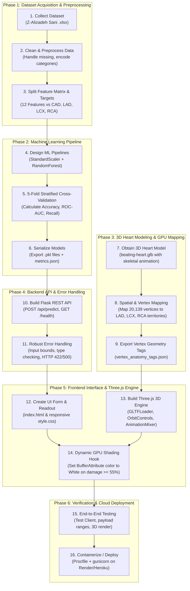

# Project Development Lifecycle: Scratch to Deployment

A step-by-step end-to-end flowchart and development guide showing how to build this entire **Cardiac 3D Risk** platform from zero to full deployment.

---

## 1. Project Implementation Flowchart

---

## 2. Step-by-Step Implementation Roadmap

### Phase 1: Data Preparation
1. **Source Dataset**: Place clinical data in `data/raw/extention_of_Z-Alizadeh_sani_dataset.xlsx`.
2. **Feature Selection (`src/config.py`)**: Select 12 key non-invasive features (Age, Sex, BMI, Blood Pressure, Smoking, Diabetes, ECG findings, Echo EF).
3. **Target Definition**: 
   - `CAD` (Overall disease)
   - `LAD` (Left Anterior Descending stenosis)
   - `LCX` (Left Circumflex stenosis)
   - `RCA` (Right Coronary Artery stenosis)

### Phase 2: ML Model Training (`src/train.py`)
1. **Model Architecture**: Use `RandomForestClassifier(class_weight='balanced')` inside a `Pipeline([('scaler', StandardScaler()), ('clf', ...)])`.
2. **Cross-Validation**: Run 5-fold stratified cross-validation to assess true generalization.
3. **Artifact Generation**: Save trained models to `models/` as `cad_model.pkl`, `lad_model.pkl`, `lcx_model.pkl`, `rca_model.pkl`.

### Phase 3: 3D Asset & Vertex Mapping
1. **GLB Model**: Place the animated cardiac model in `static/models/beating-heart.glb`.
2. **Anatomical Partitioning**: Map each vertex in the mesh to vascular coronary supply zones:
   - `LAD territory`: Anterior wall and apex.
   - `LCX territory`: Lateral and posterior left wall.
   - `RCA territory`: Inferior wall and right ventricle.
3. **Mapping Asset**: Save integer vertex tags to `static/data/vertex_anatomy_tags.json`.

### Phase 4: Backend API (`app.py`)
1. Create `/api/predict` accepting JSON clinical metrics.
2. Validate incoming types and numerical boundaries (return `422` with clear error messages if out of range).
3. Return predicted risks (`0.0` to `1.0`), categorical levels, and validation metrics.

### Phase 5: Interactive WebGL Frontend
1. **Three.js Scene (`static/js/heart3d.js`)**:
   - Initialize Perspective Camera, Studio Directional Lights, and WebGLRenderer.
   - Load `beating-heart.glb` and activate beating animation via `THREE.AnimationMixer`.
   - Bind `THREE.BufferAttribute(colors, 3)` with `material.vertexColors = true`.
2. **Damage Shader**:
   - If predicted stenosis $\ge 55\%$, set territory vertex colors to **Stark White (`#FFFFFF`)**.
   - If healthy/mild, set to natural anatomical gradient (Green/Cyan).

### Phase 6: Deployment
1. Add `Procfile` containing `web: gunicorn app:app`.
2. Configure `requirements.txt` with Flask, scikit-learn, pandas, numpy, and gunicorn.
3. Deploy to Render, Heroku, or AWS.
