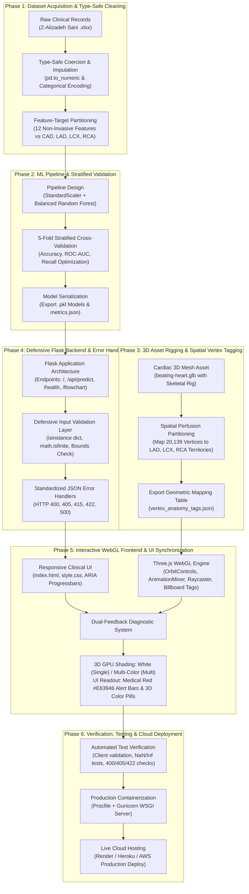

# How I Built This Project - Cardiac Risk Prediction from Scratch to Deployment

---

## 1. Project Implementation Flowchart

---

## 2. Step-by-Step Implementation Roadmap

### Phase 1: Data Acquisition & Preprocessing
1. **Source Dataset**: Store clinical data in `data/raw/extention_of_Z-Alizadeh_sani_dataset.xlsx`.
2. **Type-Safe Cleaning (`src/data.py`)**: Use explicit `pd.to_numeric` parsing to avoid zeroing out numeric fields.
3. **Feature Selection (`src/config.py`)**: Select 12 key non-invasive features (Age, Sex, BMI, Blood Pressure, Smoking, Diabetes, ECG findings, Echo EF).
4. **Target Definition**: 
   - `CAD` (Overall disease)
   - `LAD` (Left Anterior Descending stenosis)
   - `LCX` (Left Circumflex stenosis)
   - `RCA` (Right Coronary Artery stenosis)

### Phase 2: ML Model Training (`src/train.py`)
1. **Model Architecture**: Use `RandomForestClassifier(class_weight='balanced')` inside a `Pipeline([('scaler', StandardScaler()), ('clf', ...)])`.
2. **Cross-Validation**: Run 5-fold stratified cross-validation to assess true generalization.
3. **Artifact Generation**: Save trained models to `models/` as `cad_model.pkl`, `lad_model.pkl`, `lcx_model.pkl`, `rca_model.pkl`, along with validation stats in `metrics.json`.

### Phase 3: 3D Asset & Vertex Mapping
1. **GLB Model**: Place the animated cardiac model in `static/models/beating-heart.glb`.
2. **Anatomical Partitioning**: Map each vertex in the mesh to vascular coronary supply zones:
   - `LAD territory`: Anterior wall and apex.
   - `LCX territory`: Lateral and posterior left wall.
   - `RCA territory`: Inferior wall and right ventricle.
3. **Mapping Asset**: Save 20,139 integer vertex tags to `static/data/vertex_anatomy_tags.json`.

### Phase 4: Backend API & Defensive Validation (`app.py`, `src/predict.py`)
1. Create `/api/predict` accepting JSON clinical metrics.
2. Validate incoming types and numerical boundaries (return `422` with clear error messages if out of range, `NaN`, or `Infinity`).
3. Defensive JSON error handlers for `400` (non-dict payload), `405` (wrong method), `415` (unsupported media type), and `500` (server errors).
4. Return predicted risks (`0.0` to `1.0`), categorical levels, and validation metrics.

### Phase 5: Interactive WebGL Frontend & Dual Diagnostic Feedback
1. **Three.js Scene (`static/js/heart3d.js`)**:
   - Initialize Perspective Camera, Studio Directional Lights, and WebGLRenderer.
   - Load `beating-heart.glb` and activate beating animation via `THREE.AnimationMixer`.
   - Bind `THREE.BufferAttribute(colors, 3)` with `material.vertexColors = true`.
2. **Damage Shading & Multi-Area Highlights**:
   - Single artery damaged: Highlights territory in **Stark White (`#FFFFFF`, HDR overdrive multiplier 6.5)**.
   - Multiple arteries damaged: Highlights each territory in a distinct contrast color (**LAD: White, LCX: Electric Cyan, RCA: Vivid Gold**).
   - Clinical Readout Card: Highlights damaged stenosis risk in bold **Medical Red (`#E63946`)** with ARIA progressbars.
   - Healthy/mild: Retains natural anatomical gradient (Green/Cyan).

### Phase 6: Testing & Deployment
1. **Automated Verification**: Run test client checks for boundaries, `NaN`/`Inf`, and HTTP error codes.
2. **Containerization**: Configure `Procfile` containing `web: gunicorn app:app`.
3. **Deployment**: Deploy to Render, Heroku, or AWS with Python 3.11+ runtime.
