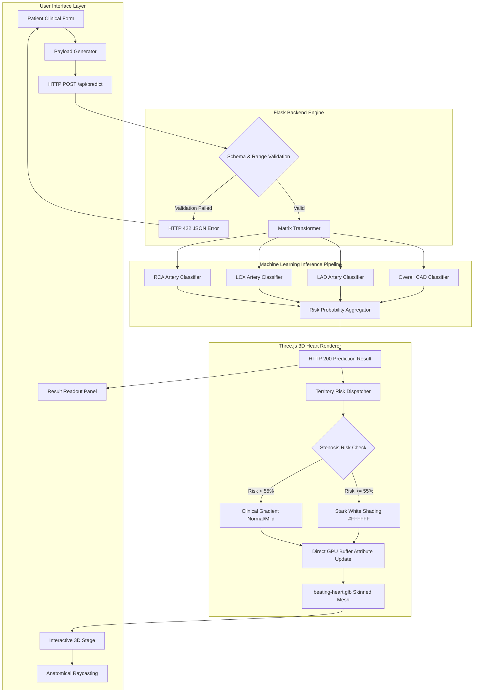

# Cardiac 3D Risk - System Architecture Flow

This document outlines the end-to-end architecture and data flow of the **Cardiac 3D Risk** platform, from patient clinical parameter collection to 3D GPU vertex color rendering.

---

## Architecture Flow Diagram

---

## Component Breakdown

### 1. User Interface Layer
- **Clinical Parameter Form**: Captures 12 patient variables (demographics, symptoms, ECG findings, and echocardiography metrics).
- **Interactive 3D Stage**: WebGL-powered 3D stage featuring a realistic beating heart model with full orbit controls.
- **Raycasting**: Allows clicking on myocardial walls and coronary vessels to inspect local risk scores and supply regions.

### 2. Backend Engine (Flask API)
- **Validation**: Ensures all numeric ranges and categorical values are strictly verified before ML execution.
- **Error Handling**: Gracefully returns `415` for invalid media types, `422` for schema violations, and `500` for server exceptions.

### 3. Machine Learning Inference Pipeline
- **Ensemble Random Forest Models**: Four trained classifiers predict:
  1. Overall Coronary Artery Disease (CAD)
  2. Left Anterior Descending (LAD) stenosis
  3. Left Circumflex (LCX) stenosis
  4. Right Coronary Artery (RCA) stenosis

### 4. Three.js 3D Heart Renderer
- **Anatomical Vertex Shading**: Direct GPU BufferAttribute updating paints damaged myocardium and stenosed vessels in stark glowing white (`#FFFFFF`).
- **Real-Time Beating Animation**: Synced with Three.js AnimationMixer for natural cardiac cycles.
