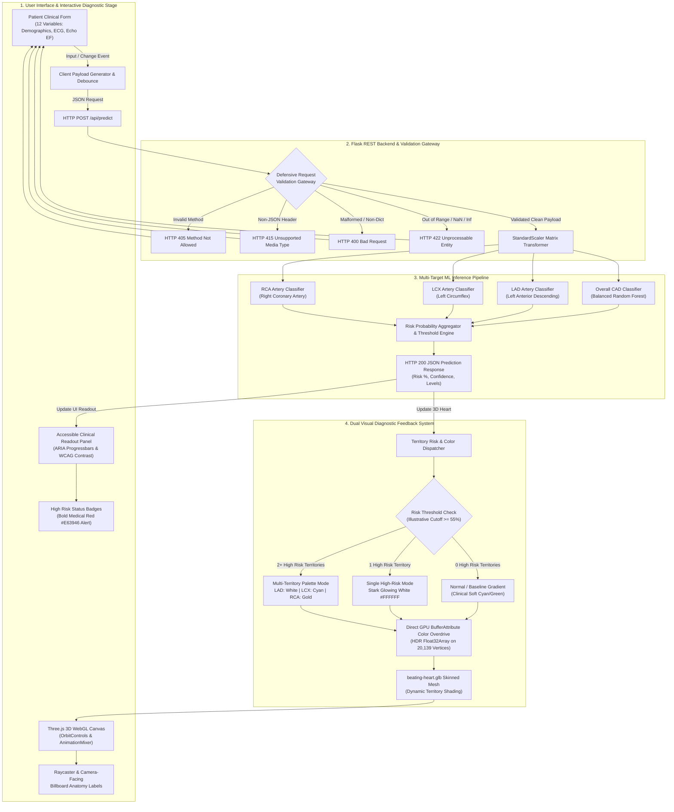

# Cardiac Risk Prediction Using ML & 3D Visualization - System Architecture Flow

This document outlines the end-to-end architecture and data flow of the **Cardiac Risk Prediction** platform, from patient clinical parameter collection and defensive API validation to 4-target machine learning inference and dual visual feedback (3D GPU vertex color overdrive & accessible medical red UI indicators).

---

## Architecture Flow Diagram

---

## Component Breakdown

### 1. User Interface Layer
- **Clinical Parameter Form**: Captures 12 patient variables (demographics, symptoms, ECG findings, and echocardiography metrics) with synchronized input/change listeners.
- **Interactive 3D Stage**: WebGL-powered 3D stage featuring a realistic beating heart model (`beating-heart.glb`) with full orbit controls and continuous skeletal animations.
- **Raycasting & Billboard Labels**: Allows clicking on myocardial walls and coronary vessels to inspect local risk scores and supply regions with depth-tested camera-facing labels.
- **Accessible Clinical Readout Panel**: Displays numerical stenosis percentages, WCAG 4.5:1 compliant contrast cards, accessible ARIA progressbars (`aria-valuenow`, `aria-live="polite"`), and bold medical red (`#E63946`) high predicted risk alert bars.

### 2. Backend Engine & Defensive Gateway (Flask API)
- **Defensive Multi-Tier Validation**:
  - `405 Method Not Allowed`: Graceful JSON error if non-POST methods are routed to `/api/predict`.
  - `415 Unsupported Media Type`: Guard if client sends raw text or non-`application/json` payload.
  - `400 Bad Request`: Rejection if JSON body is not an object/dictionary.
  - `422 Unprocessable Entity`: Strict numeric boundary checks and `math.isfinite()` validation blocking `NaN` and `Infinity`.
- **Precomputed Scaler**: Applies `StandardScaler` transformation on 12 features before inference.

### 3. Machine Learning Inference Pipeline
- **Ensemble Random Forest Classifiers**: 4 trained models predict independent probabilities:
  1. Overall Coronary Artery Disease (`CAD`)
  2. Left Anterior Descending (`LAD`) stenosis
  3. Left Circumflex (`LCX`) stenosis
  4. Right Coronary Artery (`RCA`) stenosis
- **Risk Aggregator**: Evaluates severe stenosis cutoffs (threshold $\ge 55\%$) and dispatches clinical confidence alerts.

### 4. Three.js Dual Diagnostic Feedback System
- **Real-Time GPU Vertex Shading**: Overdrives Float32 vertex colors directly into `THREE.BufferAttribute` across 20,139 tagged vertices:
  - **Single stenosed territory**: Stark Glowing White (`#FFFFFF`, HDR overdrive multiplier `6.5`).
  - **Multiple stenosed territories**: Distinct contrasting color coding:
    - **LAD**: Stark White (`#FFFFFF`)
    - **LCX**: Electric Cyan (`#00E5FF`)
    - **RCA**: Vivid Amber/Gold (`#FFB800`)
  - **Normal / Low Risk**: Clinical soft baseline gradient (`#1DD1A1` to `#00E5FF`).
- **UI Readout Synchronization**: High predicted risk territories are flagged with bold Medical Red (`#E63946`) status bars alongside 3D color pill tags for instant cross-referencing.
